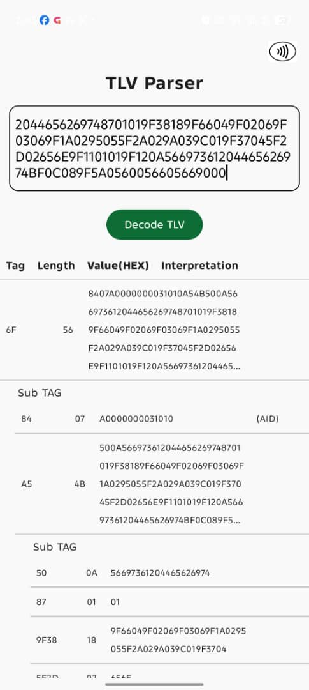
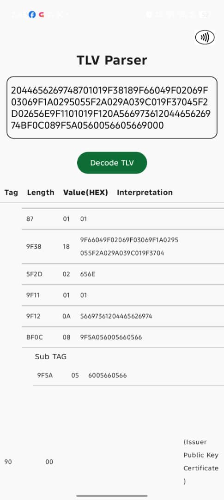
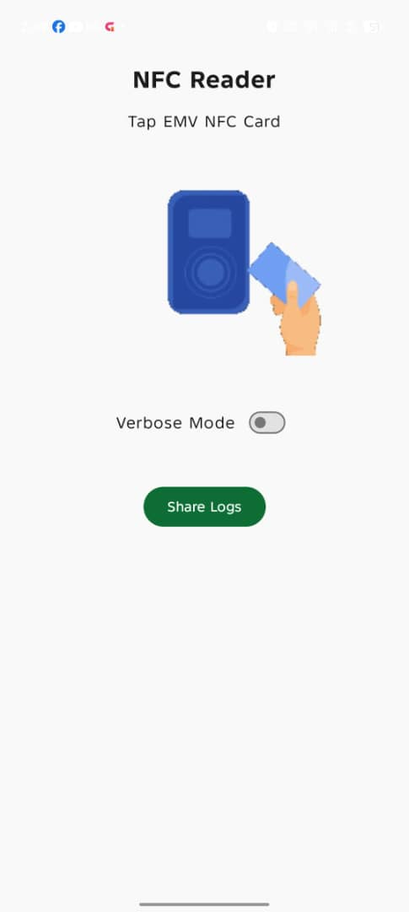
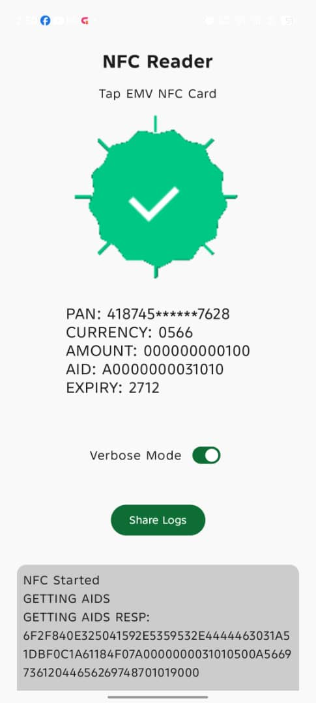
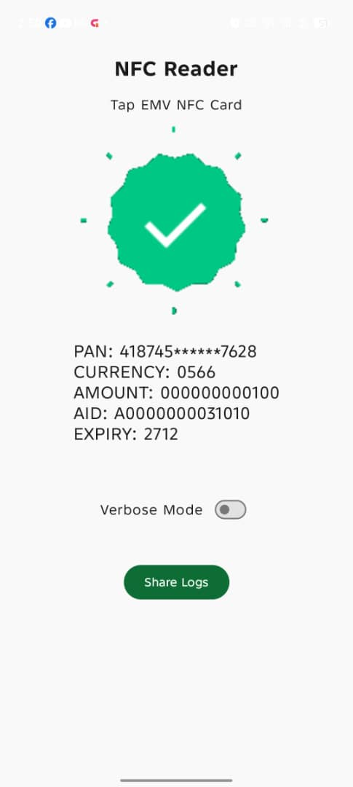

# 📱EMV PARSER NFC APP

## 🏷️ EMV
Lightweight Android app that shows how to decode a TLV which Handle multi-byte tags and lengths (BER-TLV rules) and also perform NFC EMV transaction using Mastercard and Visa card

---

## ✨ Features

* Page 1- Tlv Decoder
* Page 2- NFC Payment

---

## 🧰 Tech Stack

* **Language:** Kotlin
* **UI:** Jetpack Compose


---

## 🚀 Getting Started

### Prerequisites

* Android Studio : Narwhal 4 Feature Drop | 2025.1.4
* JDK: openjdk version "17.0.11" 2024-04-16 LTS
* Min SDK: 24

### Clone the repo

```bash
git clone https://github.com/wanoghoco/EmvParserNFCApp.git
```

### Open in Android Studio

1. Open Android Studio
2. File → Open
3. Select project folder

### Build & Run

```bash
./gradlew assembleDebug
```

---

## 🧪 Testing

Run tests:

```bash
./gradlew test
```

---

## 📱 Screenshots







---
## 📱 Download APK File

[Download the APK](apk/app-debug.apk)

---

## 📄 License

Specify your license:

* MIT
* Apache 2.0
* Proprietary

---

## 👤 Author

Your Name
WANOGHO CONFIDENCE
